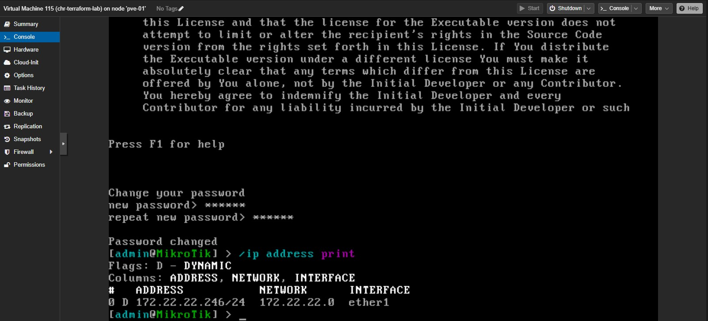

# MikroTik CHR Proxmox Utility

This directory contains a menu-driven Bash utility that automates deploying, updating, and destroying MikroTik Cloud Hosted Router (CHR) virtual machines on a Proxmox host.

## Features

- Downloads the requested CHR raw image directly from MikroTik.
- Uploads the image to the Proxmox host and converts it to a raw disk remotely using `qemu-img`.
- Automatically creates or updates a VM, imports the disk, and wires up the boot order for VirtIO storage.
- Gracefully shuts down an existing VM before updating or destroying it.
- Caches SSH credentials within a control socket so you only enter the password once per run.
- Stores all connection and VM settings in `deploy_chr.json`, editable through the interactive menu.

## Prerequisites

- A reachable Proxmox VE host with:
  - SSH access for the user defined in `deploy_chr.json` (default: `root@172.22.22.252`).
  - `qm` and `qemu-img` available in the PATH (default on Proxmox).
  - Storage defined in Proxmox matching the `storage` value (`local-lvm` by default).
- The local machine running the script needs:
  - Bash (script tested on Bash 5.x).
  - `curl`, `unzip`, and `scp`/`ssh` clients.
  - Python 3 (preferred) or Python 2 for JSON handling in the helper routines.

## Configuration

All tunable values live in `deploy_chr.json` and are loaded each time the script runs. Key sections include:

```json
{
  "proxmox": {
    "host": "172.22.22.252",
    "user": "root",
    "node": "pve-01",
    "bridge": "vmbr0",
    "storage": "local-lvm"
  },
  "vm": {
    "id": "auto",
    "name": "chr-terraform-lab",
    "memory": 512,
    "cores": 1
  },
  "image": {
    "version": "7.20.1",
    "remoteDir": "/var/lib/vz/template/iso"
  }
}
```

You can edit the file manually or from the script's "Edit configuration" menu option. Setting `vm.id` to `"auto"` makes the utility determine the next free VM ID on the Proxmox cluster; specifying an explicit numeric ID forces use of that VM.

## Usage

Run the script from this directory:

```bash
./deploy_chr.sh
```

The menu offers four options:

1. **Deploy / Update CHR VM** – Downloads the image if needed, uploads and converts it on the Proxmox host, creates (or updates) the VM, attaches the imported disk, and starts the VM.
2. **Destroy CHR VM** – Stops the VM if running, purges it from Proxmox (including disks), and removes any staged images.
3. **Edit configuration** – Prompts for each configurable value, defaulting to the current value when you press Enter.
4. **Exit** – Closes the SSH control connection and exits.

While the script is running it will show the remote commands being executed, helping with troubleshooting. An SSH control socket persists for the life of the script so the password prompt only appears once per run.

### Post-deployment checklist

Once the VM finishes booting:

> [!INFO]
> Use the TAB key to auto-complete RouterOS commands and parameters while working through the console prompts.

1. Open the VM console in the Proxmox web UI and wait for the login prompt.  
  
2. Sign in with the default `admin` user (leave the password empty) and accept the RouterOS license.  
  
3. Set a strong password for the admin account when prompted. You can change password anytime later using hte command below:  
  ```
  /user set admin password=<new-strong-password>
  ```  
  
4. Confirm the router received an IP address (DHCP by default) so you can reach it remotely.  
  ```
  /ip address print
  ```  
  
5. Enable the SSH service to allow Terraform and automation to connect.  
  ```
  /ip service set ssh disabled=no
  ```  
  
6. Verify SSH is listening.  
  ```
  /ip service print
  ```  
  
7. Continue with OpenGWTools Mikrotik Router OS Bootstrap to push default configuration via SSH.

## Notes

- The script deletes the uploaded raw image after the disk has been imported to keep `/var/lib/vz/template/iso` tidy.
- If the specified VM already exists, the imported disk is attached in place of the existing `scsi0` entry. Any unused disks are detected automatically through `qm config`.
- Networking defaults to a single VirtIO NIC bridged to `vmbr0`. Adjust `proxmox.bridge` in the JSON if you use a different bridge.
- For serial console access you can use `qm terminal <VMID>` once the VM has started.