# VPN Roadwarriors Utility

Manage a MikroTik CHR "roadwarrior" WireGuard deployment from your workstation. The utility keeps the router, local state, and generated client configs in sync so you can provision or retire users in minutes.

---

## Quick User Guide

1. **Review prerequisites** → Install the required tools for your operating system (see [Requirements](#requirements)).
2. **Inspect the configuration JSON** → Open `vpn-roadwarriors.json`, confirm every value matches your MikroTik CHR, and update anything that changed.
	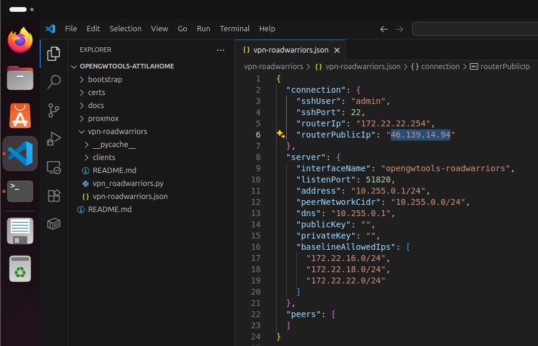
	*Caption: Connection and server sections updated in VS Code before running the script.*
3. **Launch the menu** → From `vpn-roadwarriors/`, run `./vpn_roadwarriors.py` (or `python3 vpn_roadwarriors.py`).
4. **Test the SSH connection (Menu option 1)** → Verifies credentials/host reachability before you touch WireGuard. The screenshot shows the menu selection, password prompt, and successful `/system identity print` output from the router.
	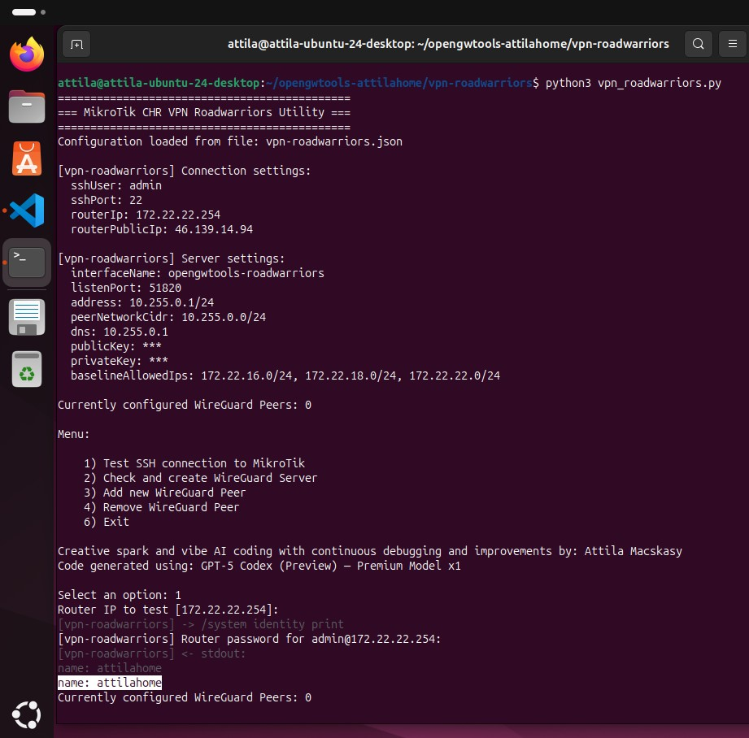
	*Caption: Menu option 1 prompting for the router password and printing the RouterOS identity.*
5. **Create or reconcile the server (Menu option 2)** → Builds the WireGuard interface, assigns the address, and syncs the local peer cache with the router. Follow the on-screen confirmations shown below: generating keys if needed, ensuring firewall rules, and validating the interface status.
	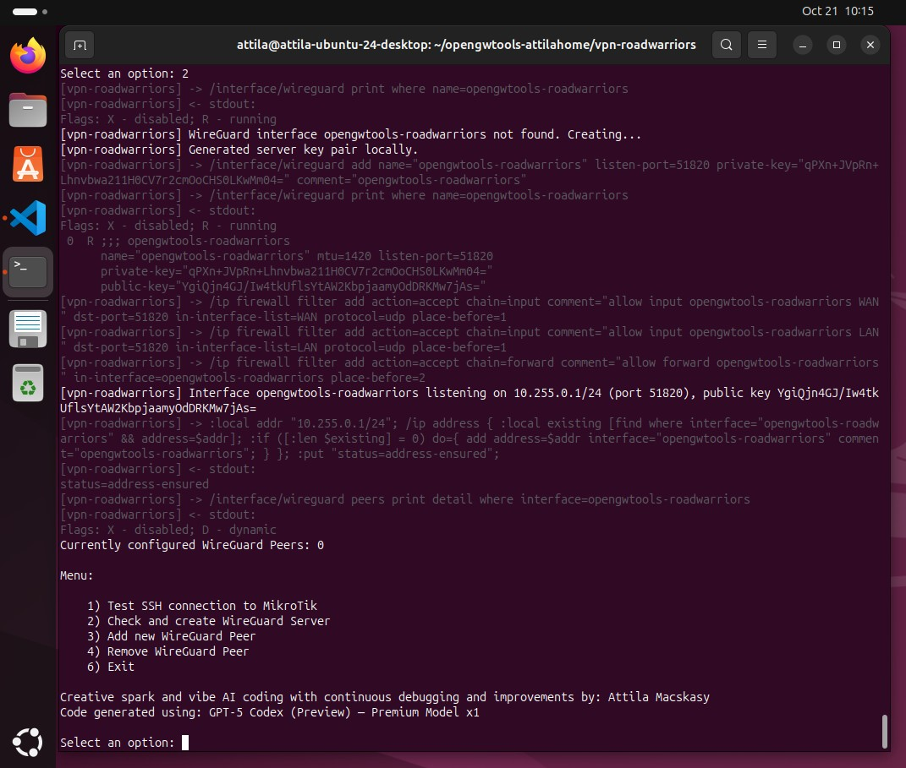
	*Caption: Script generates a WireGuard key pair and creates the `opengwtools-roadwarriors` interface.*
	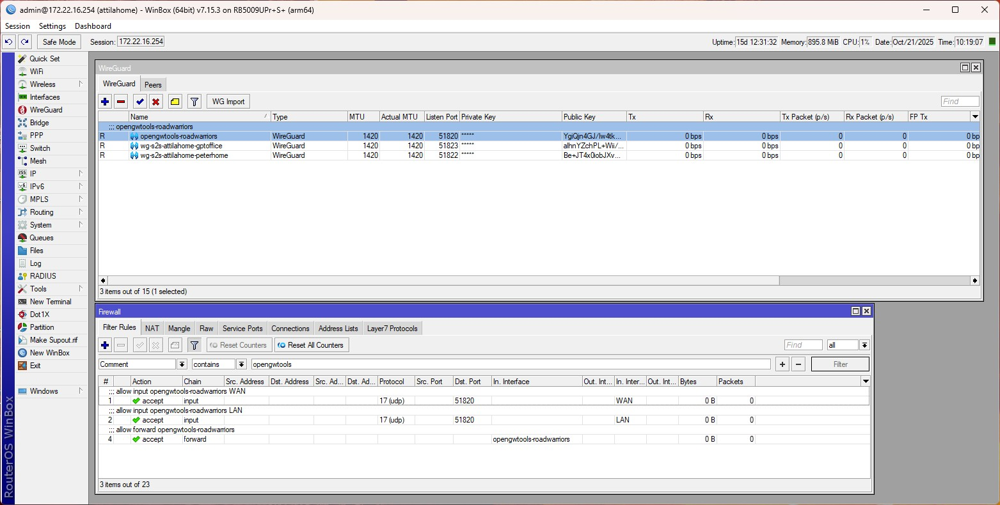
	*Caption: Interface listen port and address are synchronized with the values from the JSON file.*
	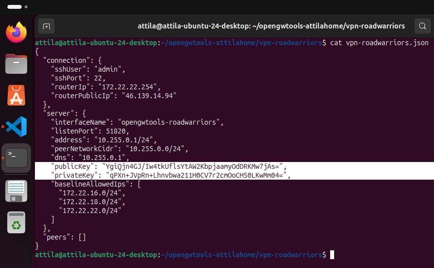
	*Caption: Firewall rules are inserted and remote peers reconciled with the local cache.*
6. **Validate in Winbox** → Check the interface and firewall rules on the CHR to confirm the automation succeeded.
7. **Add peers (Menu option 3)** → Collect a name/comment, auto-allocate an IP, push the peer to MikroTik, and create a ready-to-import client configuration. The sequence below illustrates the prompts, generated keys, router updates, and resulting client file path.
	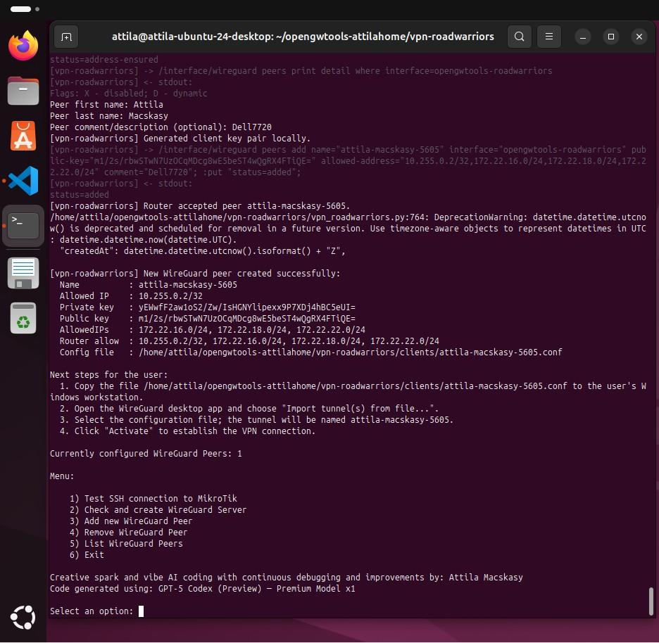
	*Caption: User enters first/last name and optional comment for the new roadwarrior profile.*
	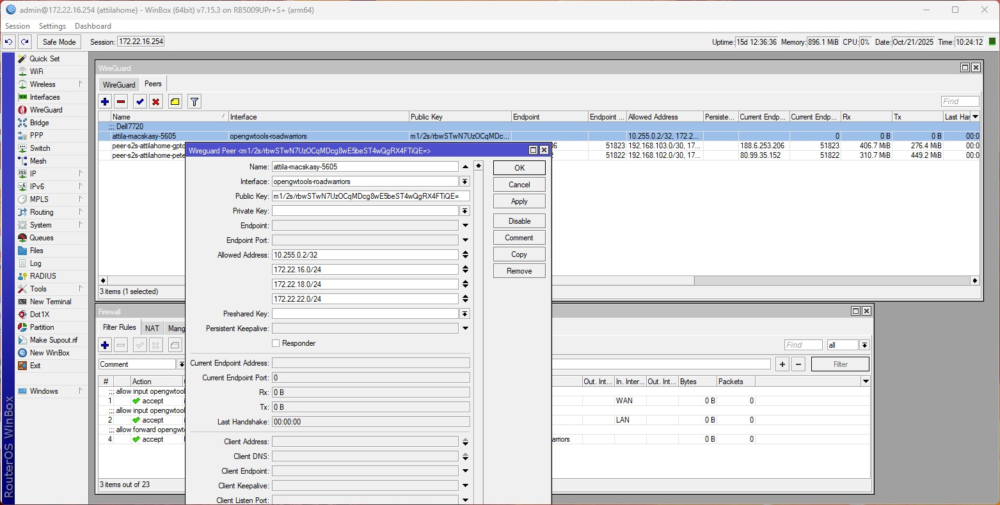
	*Caption: Script selects the next free /32 address and generates the WireGuard key pair locally.*
	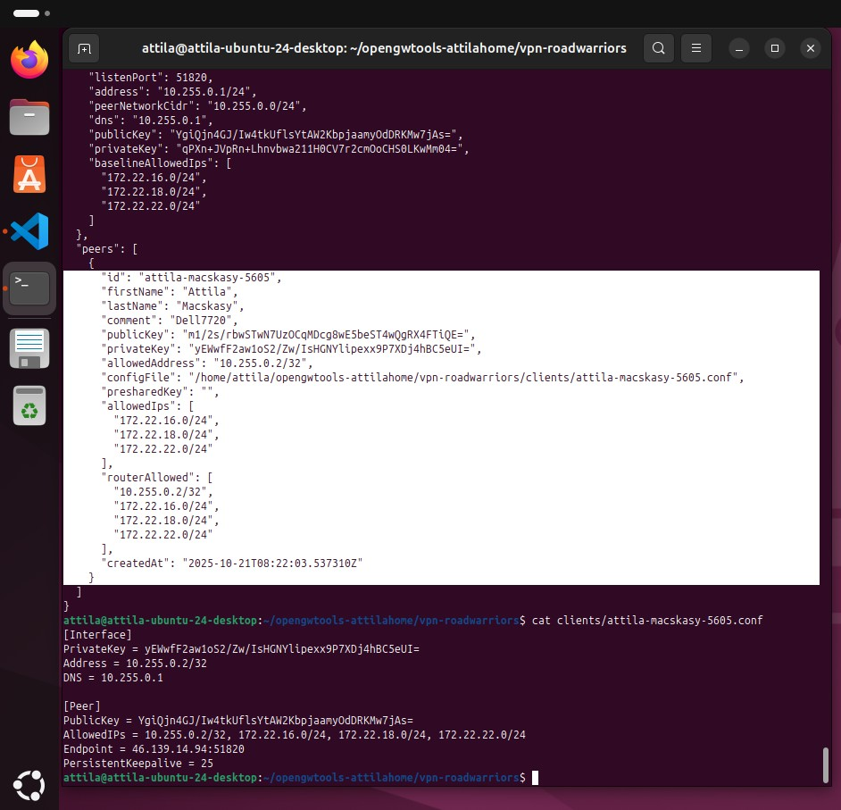
	*Caption: RouterOS commands add the peer and configure allowed-address entries through SSH.*
	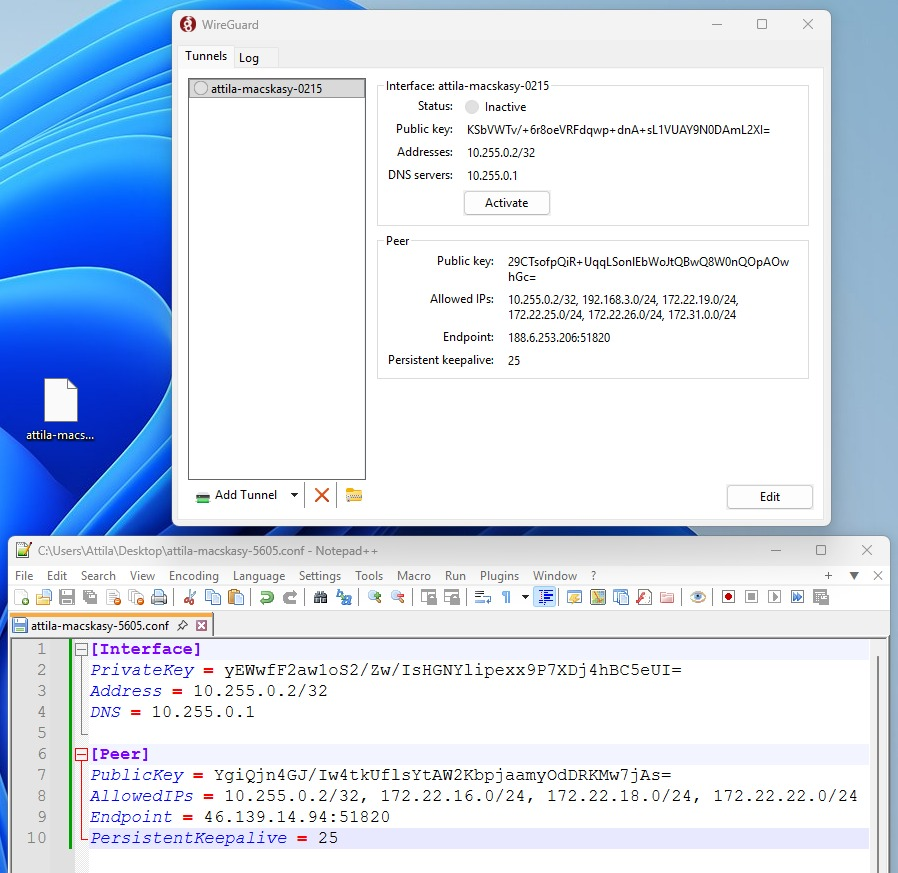
	*Caption: Confirmation that the peer was created and the client `.conf` file written to disk.*
	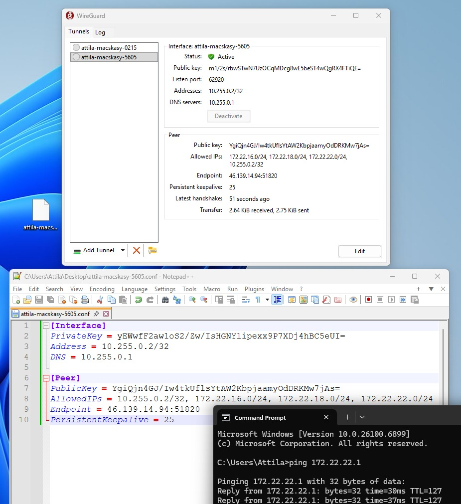
	*Caption: Menu refresh showing the newly added peer in the managed list and updated count.*
8. **List or remove peers (Menu options 5 & 4)** → Review the numbered table, back up configs if needed, and delete entries cleanly from the router, JSON, and filesystem.
9. **Distribute configs to users** → Follow the platform-specific steps in [Configuring VPN Clients](#configuring-vpn-clients) for Windows, iPhone, or macOS.

Keep the JSON file under version control (or at least backed up) so your inventory survives workstation replacements.

---

## Configuration Reference (`vpn-roadwarriors.json`)

| Path | Type | Default | Description |
|------|------|---------|-------------|
| `connection.sshUser` | string | `admin` | MikroTik SSH username. Used everywhere the tool opens a session.
| `connection.sshPort` | integer | `22` | TCP port for SSH; must be open on the CHR.
| `connection.routerIp` | string | `172.22.254.254` (or bootstrap value) | Private/IPSec-reachable address for SSH. Can be LAN, VPN, or management subnet.
| `connection.routerPublicIp` | string | mirrors `routerIp` when omitted | WAN address the WireGuard clients should dial. Update whenever the public IP changes.
| `server.interfaceName` | string | `opengwtools-roadwarriors` | Target WireGuard interface name created/managed on the MikroTik.
| `server.listenPort` | integer | `51820` | UDP port exposed on the CHR. The utility also inserts matching firewall rules.
| `server.address` | CIDR | `10.255.0.1/24` | Address assigned to the WireGuard interface.
| `server.peerNetworkCidr` | CIDR | `10.255.0.0/24` | Allocation pool for roadwarrior peers. The script assigns `/32` hosts sequentially.
| `server.dns` | string | `10.255.0.1` | DNS server announced inside client configs.
| `server.publicKey` | base64 | empty | Auto-populated. Leave blank; the script will generate/fetch it.
| `server.privateKey` | base64 | empty | Auto-populated and masked in the UI.
| `server.baselineAllowedIps` | array | `["0.0.0.0/0", "::/0"]` | Network list appended to every peer. Edit to push specific subnets (e.g., `172.22.16.0/24`).
| `peers` | array | empty | Populated automatically. Each entry records the generated keys, allocated address, router metadata, and the path to the local `.conf` file.

> **Always review this file before running the script.** A stale public IP or subnet value will result in broken configs or unreachable servers.

---

## Requirements

### Windows 10/11 workstation
- **Python 3.10+** – Install from [python.org](https://www.python.org/downloads/) and check “Add Python to PATH" during setup.
- **OpenSSH Client** – Enable via *Settings → Apps → Optional Features → Add a feature → OpenSSH Client* (or use PowerShell `Add-WindowsCapability`).
- **Optional: sshpass** – Not available natively. If you require stored passwords, use Windows Subsystem for Linux or switch to key-based auth.
- **WireGuard tools** – Install the WireGuard desktop app for validating configs on the same machine if desired (not required for provisioning).

### Linux (Debian/Ubuntu, Arch, RHEL, etc.)
- **Python 3.8+** – Already available on most distros (install via package manager if missing).
- **OpenSSH client** – Usually preinstalled; otherwise install `openssh-client`.
- **Optional: sshpass** – `sudo apt install sshpass` (or equivalent) enables password prompts without key-based auth.
- **Optional: python3-cryptography** – Speeds up key generation without needing the `wg` CLI.

### macOS 12+
- **Python 3.10+** – Install via [Homebrew](https://brew.sh) (`brew install python@3.11`) or Python.org installer.
- **OpenSSH client** – Built into macOS.
- **Optional: sshpass** – Install with Homebrew (`brew install hudochenkov/sshpass/sshpass`).
- **WireGuard app** – Available via the App Store for testing client configs.

The script prefers Python’s `cryptography` module for key generation; if it’s missing, it falls back to the `wg` CLI when available. Install at least one method.

---

## Preparing the Environment

1. **Clone or update the repository** on your workstation.
2. **Open `vpn-roadwarriors/vpn-roadwarriors.json`** and adjust every field described above.
	- Replace the placeholder public IP with your CHR’s current WAN IP.
	- Update the baseline networks so clients receive the correct routes.
	- Do *not* manually edit the `peers` section; let the tool manage it.
3. **Ensure SSH reachability** from the machine where you will run the helper (firewall rules and credentials must already be in place).
4. **Make the script executable (optional)**: `chmod +x vpn_roadwarriors.py` on Unix-like systems.

---

## Running the Utility

1. **Launch the helper**
	```bash
	cd vpn-roadwarriors
	./vpn_roadwarriors.py
	```
	On Windows, open PowerShell, navigate into the folder, and run `python.exe .\vpn_roadwarriors.py`.

2. **Review the startup summary**
	- The banner shows sanitized connection/server settings. If you notice an incorrect value, exit the tool, correct `vpn-roadwarriors.json`, and relaunch.

3. **Menu option 1 – Test SSH connection**
	- Confirms credentials and reachability.
	- You can override the IP at the prompt; accepted values are saved back to the JSON file.
	- If the command fails, fix networking or credentials before continuing.

4. **Menu option 2 – Check and create WireGuard server**
	- Generates the server key pair if missing.
	- Creates the WireGuard interface and assigns the configured IP address.
	- Installs the input and forward firewall rules for UDP `listenPort`.
	- Reconciles the local peer cache with the router (removing stale entries).

5. **Validate in Winbox**
	- Open Winbox, connect to the CHR, and check:
	  - **Interfaces → WireGuard** – `opengwtools-roadwarriors` should exist with the correct listen port and public key.
	  - **IP → Addresses** – The configured `/24` is bound to the WireGuard interface.
	  - **IP → Firewall → Filter** – The newly inserted rules allow UDP `listenPort` on WAN/LAN and forward traffic from the WireGuard interface.

6. **Menu option 3 – Add new WireGuard peer**
	- Enter the user’s first/last name and an optional comment.
	- The script allocates the next `/32`, generates client keys, pushes the peer to MikroTik with combined allowed networks, and writes the `.conf` file to `clients/`.
	- Copy the generated file to the user immediately; it contains the private key and isn’t recoverable later.

7. **Menu option 5 – List WireGuard peers**
	- Shows a numbered table with ID, name, and comment. Useful when verifying inventory or before removal.

8. **Menu option 4 – Remove peer**
	- Displays the same numbered table, prompts for confirmation, deletes the peer from the router, prunes the JSON, and removes the local `.conf` file.

9. **Menu option 6 – Exit**
	- Safely leaves the utility. All actions are persisted as they happen; there is no separate save step.

---

## Configuring VPN Clients

After provisioning a peer, provide the exported `.conf` file to the user (secure email, MDM, or direct transfer). Follow the platform-specific import path to preserve the allowed routes defined in `baselineAllowedIps`.

### Windows (WireGuard for Windows)
1. Install the [WireGuard client](https://www.wireguard.com/install/).
2. Launch the app and click **Import tunnel(s) from file…**.
3. Select the `.conf` file. The tunnel adopts the peer ID as its name.
4. Review the details (Allowed IPs, endpoint address). Click **Activate** to start the VPN.
5. Use **Logs → Export** to capture diagnostics if connectivity fails.

### iPhone / iPad (WireGuard iOS)
1. Email or AirDrop the `.conf` file to the device.
2. Tap the attachment, choose **Copy to WireGuard** (or **Open in WireGuard**).
3. In the app, select **Create from file or archive**—this route exposes the `Allowed IPs` section automatically.
4. Confirm the imported tunnel shows the expected routes and endpoint, then tap **Save**.
5. Toggle the switch to connect.

> Creating a tunnel “from scratch” inside the iOS app hides the Allowed IPs field and breaks routing. Always import the configuration file instead.

### macOS (WireGuard for macOS)
1. Install WireGuard from the [Mac App Store](https://apps.apple.com/app/wireguard/id1451685025).
2. Launch WireGuard and click **Import tunnel(s) from file…**.
3. Pick the `.conf` file, review the summary, and click **Save**.
4. Enable the tunnel from the menu bar icon when ready to connect.
	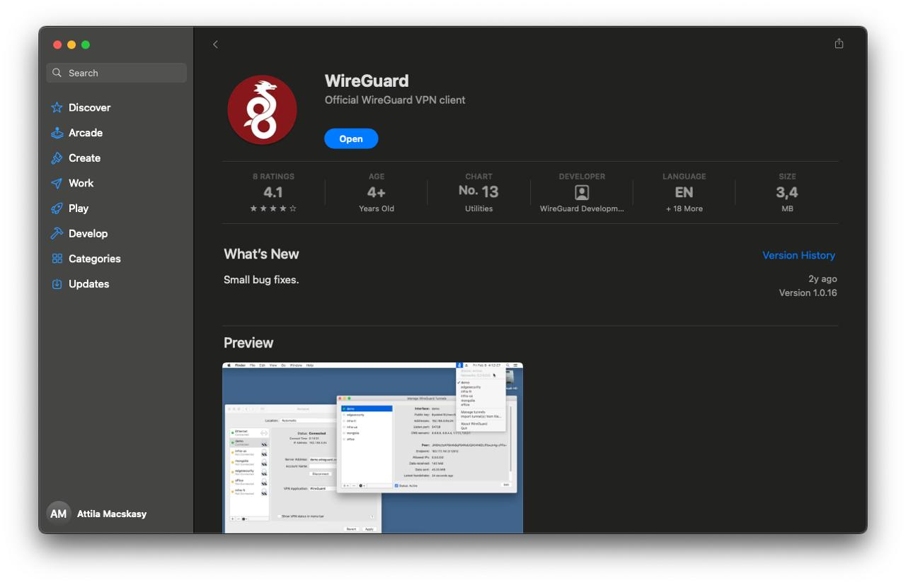
	*Caption: WireGuard for macOS ready to import the generated `.conf` from the `clients/` folder.*
	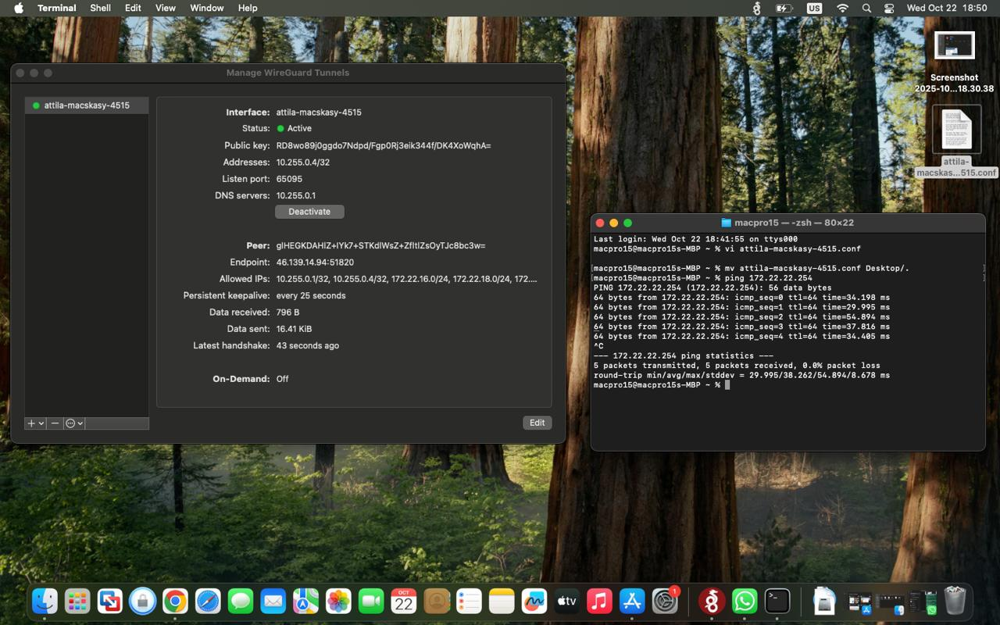
	*Caption: Imported roadwarrior tunnel visible in the macOS client, ready for activation.*

> The macOS client works seamlessly with configs produced by this tool—copy the desired `.conf` from `vpn-roadwarriors/clients/` to your Mac and import it through the dialog above.

---

## Field Validation Tips

- **Connectivity smoke test** – After a client connects, ping the WireGuard interface (`10.255.0.1` by default) and any internal subnets listed in `baselineAllowedIps`.
- **Router-side visibility** – In Winbox or the CLI, check `/interface wireguard peers print detail` to confirm the peer shows the correct `allowed-address` list and has recent handshake times.
- **Firewall logs** – If traffic stalls, use Winbox **IP → Firewall → Connections** or **Log** with filter rules to spot drops.
	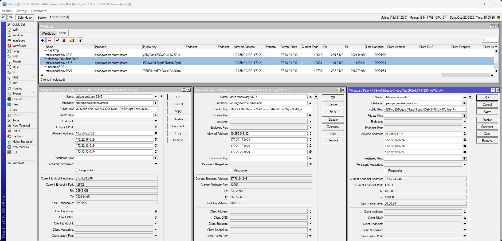
	*Caption: Winbox → Interfaces → WireGuard → double-click the peer to view endpoint IP/port, RX/TX counters, and last-handshake timer.*
- **Winbox monitoring** – Double-click the peer entry inside **Interfaces → WireGuard → Peers** to see the endpoint IP/port, byte counters, and last handshake (highlighted above). A ticking handshake under a minute and increasing RX/TX confirm that packets are flowing. Stale handshakes point to firewall or connectivity issues; reset by toggling the client tunnel or verifying `AllowedIPs` routes.
- **Reconciling state** – If a peer never appears in Winbox, rerun menu option 2 then option 5 to re-sync the server and ensure the local cache matches the router.

Security hardening: each peer’s allowed-address list only includes its own /32 endpoint, the WireGuard server (`10.255.0.1/32`), and the networks defined in `baselineAllowedIps`. As a result, roadwarriors cannot reach each other directly; they only see the gateway and the sanctioned internal subnets.

---

## Troubleshooting Essentials

- **SSH failures** – Test with `ssh admin@routerIp` outside the tool; resolve host keys, passwords, or firewall blocks before continuing.
- **Key generation errors** – Install Python’s `cryptography` package (`pip install cryptography`) or the WireGuard tools (`apt install wireguard-tools`) so the script can produce keys locally.
- **Interface already exists** – Option 2 simply reuses the interface, updates listen port/address, and refreshes metadata—safe to run multiple times.
- **Peer already present on router** – The helper warns about unmanaged peers; add them manually or remove them from the CHR to keep things in sync.
- **Stuck handshakes** – In Winbox, open **Interfaces → WireGuard → Peers** and confirm the endpoint IP/port, RX/TX counters, and last handshake (see screenshot above). If the timer never resets, verify the client has the correct `AllowedIPs`, the CHR firewall permits UDP from the displayed endpoint, and there is no NAT device rewriting ports unexpectedly.

Keep iterating—this utility is intentionally modular so you can extend it with MDM distribution, MFA enrollment, or monitoring hooks without reworking the core workflow.

## Windows compatibility notes

The utility was originally authored on Ubuntu, but the current release includes several improvements to work smoothly on Windows as well:

- **Password-based SSH** – When `sshpass` is unavailable (default on Windows), the script falls back to Paramiko so you can enter the router password once and reuse the same session. Install it with `pip install paramiko`.
- **Handled ANSI colors** – The prompts now auto-detect consoles that don’t support ANSI escape sequences and disable color codes to avoid stray `←[90m` artifacts.
- **Plain-text command output** – SSH responses invoked through Paramiko are decoded and printed without the Python byte-string prefixes (no `b'…'` clutter), matching the Linux behavior.

With these adjustments the menu flow, WireGuard provisioning, and file generation behave the same on both Windows PowerShell and Linux shells.
